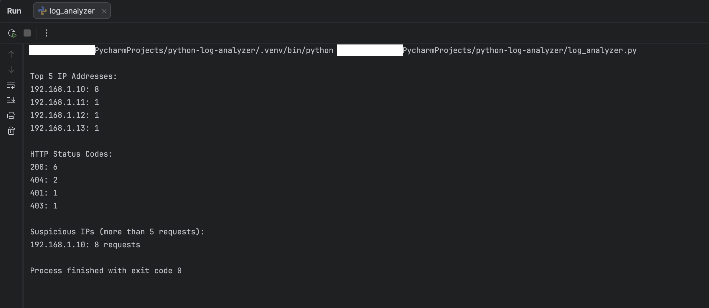

# Python Log Analyzer

## Overview
This project is a Python-based log analysis tool designed to parse web server logs and identify potentially suspicious activity. It analyzes IP address frequency, HTTP status codes, and flags abnormal behavior such as repeated requests from a single source.

## Features
- Extracts and counts IP addresses from log files
- Analyzes HTTP status code distribution
- Identifies high-frequency (suspicious) IP activity
- Uses regular expressions for pattern matching
- Outputs results in a clean, readable format

## Technologies Used
- Python 3
- Regular Expressions (`re`)
- Collections (`Counter`)

## How It Works
The script reads a log file (`sample.log`) and:
1. Extracts IP addresses from each log entry
2. Extracts HTTP status codes
3. Counts occurrences using Python's Counter
4. Identifies IPs with unusually high request volumes

## Example Output




## How to Run
1. Open the project in PyCharm or any Python IDE
2. Ensure `sample.log` is in the same directory
3. Run:
```bash
python log_analyzer.py

## Author
Courtney Hamilton